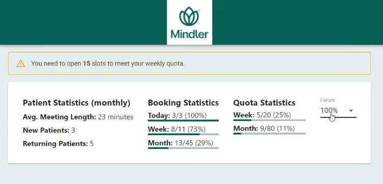
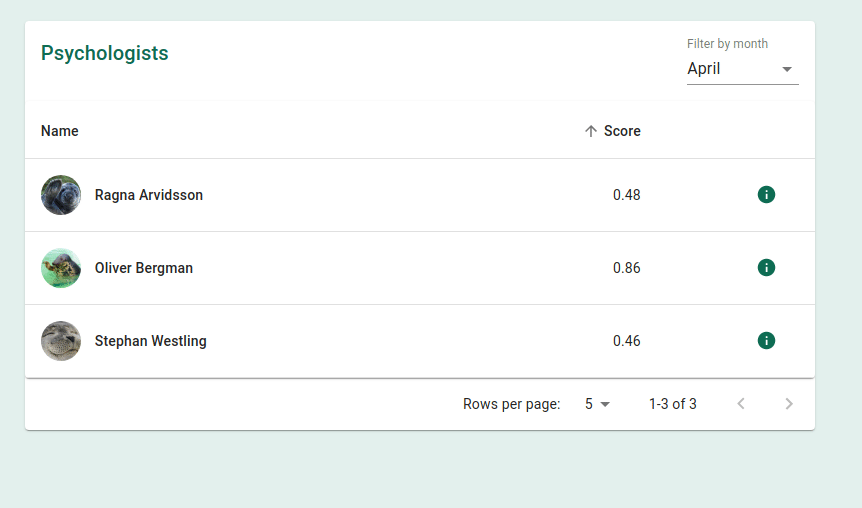

# Final Project at &lt;/salt>
The final project we did at the &lt;/salt> bootcamp for the health-tech company Mindler.

## Overview
The final project comprised of two parts: 
  1. A psychologist component which provided the psychologists with an overview of their booking statistics, quota and other
  patient statistics specific to them. [**See Demo 1**]
  
  2. An admin component which displayed information about different psychologists and a score related to their performance.
  [**See Demo 2**]

## Specifications
The specifications of the project was to write stand-alone components that could easily be integrated to our client's existing codebase.

### Demo 1

### Demo 2

